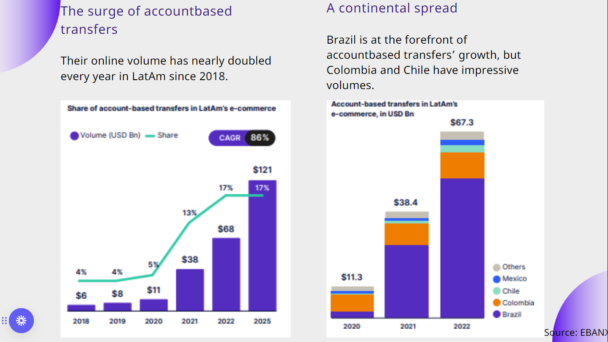
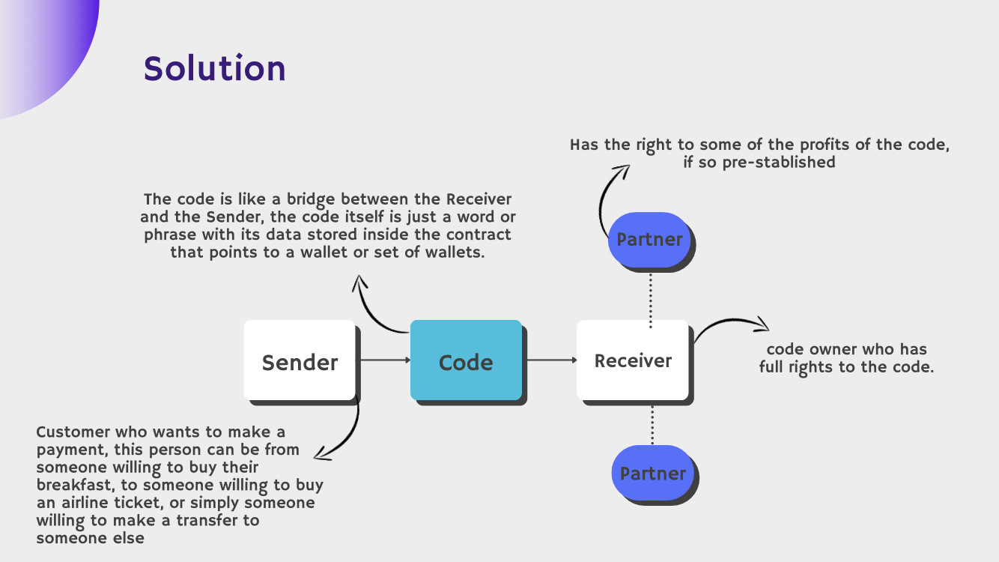
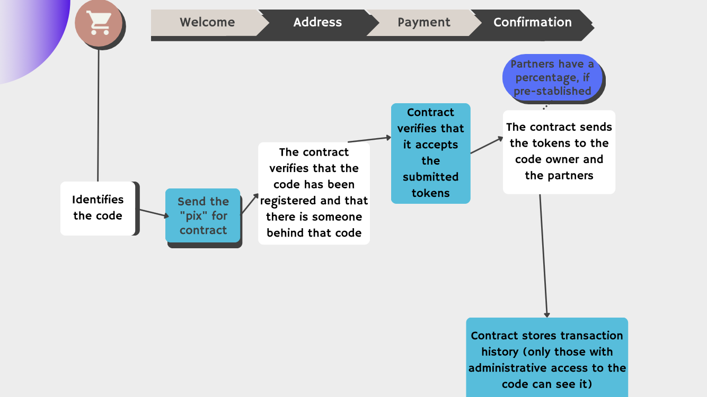
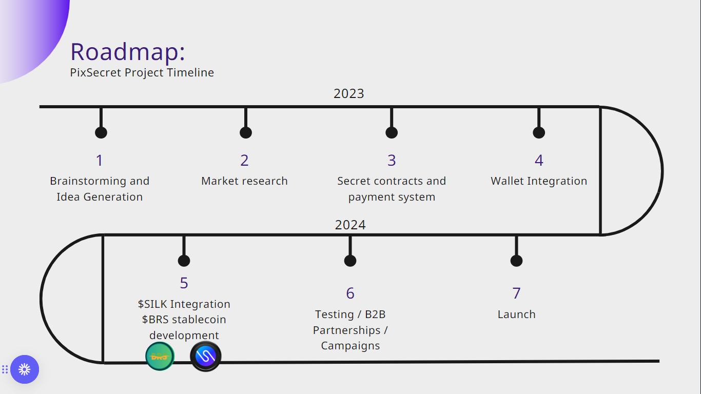

<div align="center">

[](https://travis-ci.org/rmanguinho/clean-react)
[](https://coveralls.io/github/rmanguinho/clean-react?branch=master)
[](https://snyk.io/test/github/rmanguinho/clean-react)
[](http://standardjs.com)
[](https://opensource.org/licenses/)
[](https://opensource.org/)
</div>


<div align='center'>

# *PixSecret - Secret DeFi Platform for the LATAM*
</div>


[](./public/logo.png)

PixSecret is a DeFi Platform and a payment system built on Secret Network, specifically for the LATAM (Latin America) industry. The goal of the project is to address the usability and privacy issues faced by public blockchains when it comes to requesting and receiving cryptocurrency. PixSecret leverages the capabilities of Secret Network to provide private payments and invoice requests, ensuring transactional privacy for day-to-day use.

The goal is to bring accessibility, ease and security to everyday transactions using the latest technologies. The Back-End is developed using Rust with Secret smarts contracts.

The Front-End was developed using several methodologies such as a well defined and decoupled architecture, using TDD (test-driven programming) as work methodology, Clean Architecture to make the distribution of responsibilities in layers, always following the principles of SOLID, DRY, YAGNI, KISS and applying Design Patterns to solve some common problems.
<br /><br />

<div align="center" style="width: 100%; display: block;">

 
</div>


</div>


<div style="padding: 0 5rem;">


# Indice

- [About](#ProblemSolution)
- [Solution Details](#SolutionDetails)
- [Methodologies Used](#MethodologiesUsed)
- [Technologies Used](#TechnologiesUsed)
- [How to execute the project](#Execute)
- [How to execute the project](#Execute)

<div id="ProblemSolution">

## 🔖&nbsp; Problem / Solution
</div>


Public blockchains, by default, lack transactional privacy and face challenges in terms of usability for requesting and receiving cryptocurrency. To achieve mass adoption, there is a need for private payments and invoice requests. In Latin America, alternative payment methods (APMs) such as bank transfers and digital wallets are becoming increasingly popular. PixSecret aims to offer an alternative solution by providing private payment requests that are easy, fast, and encrypted. The project utilizes cross-chain smart contract calls to enable interchain functionality, allowing businesses and users on public chains to trigger private invoice settlement transactions on Secret Network.

<div align="center" style="width: 100%; display: block;">

 
</div>


<div id="SolutionDetails">

## 🔖&nbsp; Solution Details
</div>

Private payment requests. Easy, fast and encrypted. 

PixSecret introduces $BRS, a fully-backed stablecoin and digital token tied to the Brazilian Real (BRL). This stablecoin will be available 24/7 and can be quickly and securely used in transactions. $BRS will be connected to various blockchains such as Ethereum and Polygon, always benefiting from the privacy layer provided by Secret Network. Users will be able to trade $BRS for Brazilian Reais on a 1:1 basis.

$SILK will be one of the biggest assets and store of value in our platform. All users and companies would be onboarded, making Crypto as a protection against inflation, as Latin American countries have some of the highest inflation rates worldwide.

<div align="center" style="width: 100%; display: block;">

 
</div>
</div>
<div align="center" style="width: 100%; display: block;">

 
</div>
</div>

<div id="SolutionDetails">

## 🔖&nbsp; Roadmap 
<div align="center" style="width: 100%; display: block;">

 
</div>
</div>
<br/>
<div id="ValueEcosystem">

## Value capture for Secret Network ecosystem

Transacting crypto assets privately is the key to mass adoption, this has been achieved by Secret Network already. We believe this can drive a lot of users from other chains to Secret Network, and help people and companies in areas they need this solution.
</div>
---

<div id="MethodologiesUsed">

 ## ㊎ Methodologies used for development
</div>


* TDD
* Clean Architecture
* DDD
* Reactive Programming
* Responsive Layout
* Conventional Commits
* GitFlow
* Modular Design
* Dependency Diagrams
* Use Cases
* Continuous Integration
* Continuous Delivery
* Continuous Deployment

## 📚 Principles

* Single Responsibility Principle (SRP)
* Open Closed Principle (OCP)
* Liskov Substitution Principle (LSP)
* Interface Segregation Principle (ISP)
* Dependency Inversion Principle (DIP)
* Separation of Concerns (SOC)
* Don't Repeat Yourself (DRY)
* You Aren't Gonna Need It (YAGNI)
* Keep It Simple, Silly (KISS)
* Composition Over Inheritance
* Small Commits

## ㌥ Design Patterns

* Factory
* Adapter
* Composite
* Decorator
* Dependency Injection
* Composition Root
* Builder
* Proxy

<div id="TechnologiesUsed">

## 🚀 Technologies Used
</div>


* [Typescript](https://www.typescriptlang.org/)
* [React](https://www.typescriptlang.org/)
* [React Testing Library](https://www.typescriptlang.org/)
* [React Router DOM](https://reactrouter.com/en/main)
* [Vitest](https://vitest.dev/)
* [Git](https://git-scm.com/)
* [Yarn](https://yarnpkg.com/)
* [Eslint](https://eslint.org/)
* [Secret Network](https://scrt.network)
  
---
---

<div id="Execute">

## 🗂 How to run the Client (Front-End)
</div>

```bash

    # Clone the repository
    $ git clone https://github.com/nironwp/hackathon-pix-secret.git

    # Enter the directory
    $ cd hackathon-pix-secret

    # Install the dependencies
    $ yarn install

    # Start the project
    $ yarn start
```

## 🗂 How to Upload and Deploy (Smart Contract)

```bash

    # Clone the repository
    $ git clone https://github.com/nironwp/hackathon-pix-secret.git

    # Enter the directory
    $ cd hackathon-pix-secret/contract/deploy

    # Install the dependencies
    $ node index.mjs
```

### Team Members

- [Pedro Mendes](https://www.linkedin.com/in/gopedro/) - Full Cycle Developer
- [Luca Fortes](https://www.linkedin.com/in/lucafortes7/) - Community Relations
- [Pedro Pelicioni](https://www.linkedin.com/in/pedro-pelicioni/) - Frontend Developer

</div>